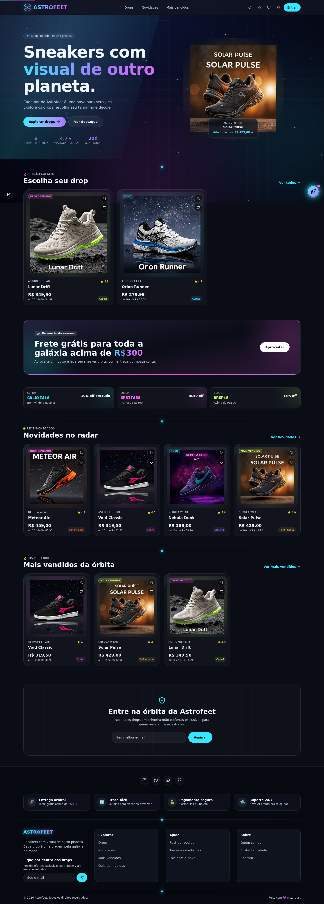
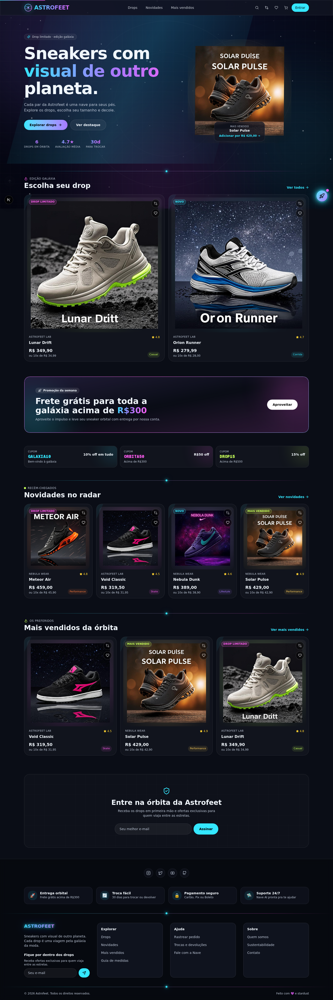
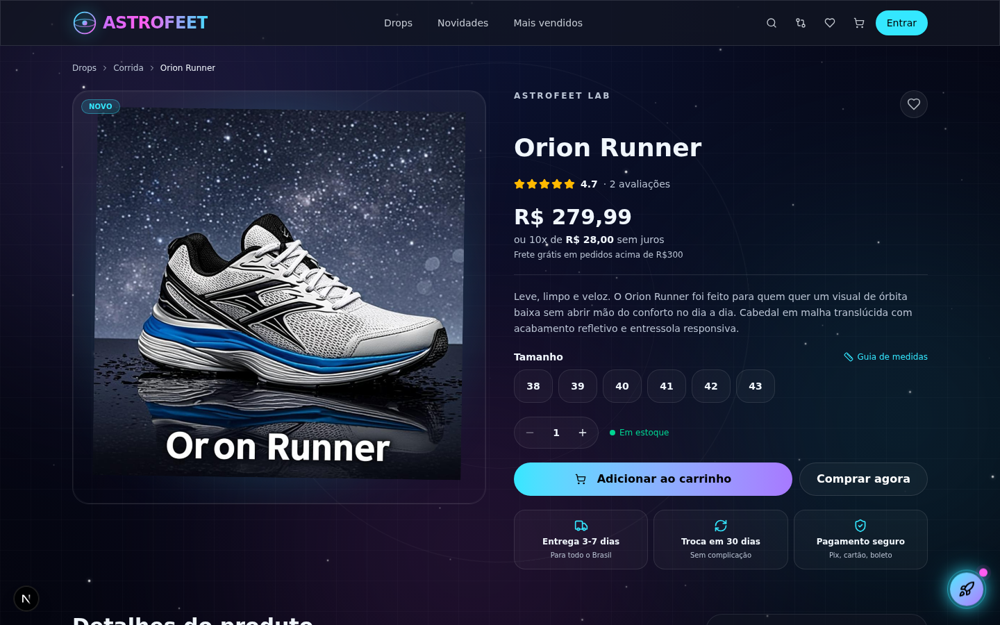
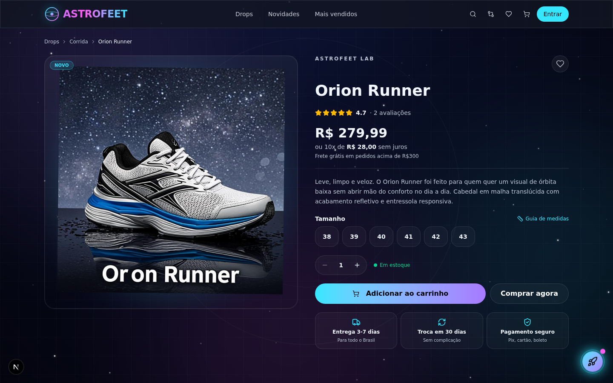
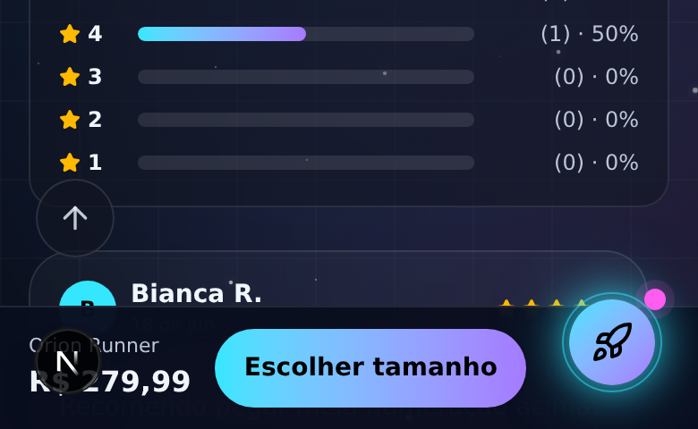

# Astrofeet — Antes e depois

Capturas feitas com o mesmo script (Playwright), mesmo banco de dados e mesma resolução
(1440×900 desktop, 390×844 mobile). Pastas: [`before-after/before`](before-after/before) · [`before-after/after`](before-after/after).

## Visual / UX

| Tela | Antes | Depois |
|---|---|---|
| Home (página inteira) |  |  |
| Produto (desktop) |  |  |
| Produto (mobile) — barra de compra fixa | _não existia_ |  |

### O que mudou na experiência

| Problema antes | Depois |
|---|---|
| Sem URL por tela: botão **voltar** saía do site, não dava para compartilhar um produto ou filtro | Cada tela tem URL (`#/produto/orion-runner`, `#/drops?category=Skate`, `#/favoritos`…). Voltar/avançar e links diretos funcionam |
| Título da aba sempre igual | Título por tela e pelo nome do produto |
| Sem salto para o conteúdo / foco perdido ao trocar de tela | Link "Pular para o conteúdo" + foco devolvido ao conteúdo após navegar |
| Admin (3,5 mil linhas), conta e checkout carregados para todo visitante | Telas e modais carregam sob demanda (code splitting) com skeleton |
| Grid com 2 itens deixava ⅓ da linha vazio (Drops) e 3 de 4 colunas (Mais vendidos) | Colunas se ajustam ao nº de itens |
| Textos de 10 px em cards (parcelas, categoria, selos) | 11–12 px |
| No mobile o botão de compra sumia ao rolar a página do produto | Barra fixa com preço + "Escolher tamanho"/"Adicionar" quando o CTA sai da tela |
| Rastreio de pedido com e-mail opcional | E-mail obrigatório (também no backend, ver abaixo) |

## Segurança e arquitetura

| Tema | Antes | Depois |
|---|---|---|
| Estrutura | Tudo misturado em `src/lib` (banco, hash de senha e cliente HTTP lado a lado) | `src/server` (back) · `src/client` (front→HTTP) · `src/shared` (tipos/formatação). Ver [ARQUITETURA.md](ARQUITETURA.md) |
| Fronteira | Nada impedia o front de importar o banco | ESLint **barra** `components/stores/hooks/client → server` e `server → UI`; arquivos do servidor usam `server-only` |
| Conta admin | `admin@astrofeet.com` / `admin123` semeada em qualquer ambiente | Só em dev. Produção: admin vem de `ASTROFEET_ADMIN_EMAIL/PASSWORD` (≥12 chars); aviso no log se sobrar senha de demo |
| Sessão | Papel e nome lidos do cookie: admin removido/rebaixado seguia como admin por 7 dias | Usuário relido do banco a cada requisição |
| Rastreio de pedido | Só o código bastava (e-mail opcional) → vazava nome e cidade; código `AST-` + 6 dígitos de timestamp | E-mail obrigatório, resposta idêntica p/ "não existe" e "e-mail errado", rate limit; código aleatório de 8 hex |
| Cupom de resgate de pontos | Reutilizável infinitas vezes | Uso único; regra de cupom única (`server/coupons.ts`) para preview e pedido |
| Concorrência | Pedidos/resgates simultâneos podiam vender o mesmo estoque ou gastar os mesmos pontos 2× | Mutex por chave (`server/lock.ts`). Teste: 6 pedidos paralelos p/ 1 unidade → 1 criado |
| CSRF | Só `SameSite=Lax` | `proxy.ts` rejeita POST/PUT/PATCH/DELETE de outra origem (403) |
| Força bruta | Limite só por IP (Map sem limpeza) | Limite por IP **e** por e-mail no login; limpeza periódica; limites novos em cupom, avaliação, rastreio e resgate; tempo de resposta do login não revela se o e-mail existe |
| Exportação CSV | Células `=...` viravam fórmula no Excel | Neutralizadas |
| Imagens de produto (admin) | Qualquer string (`javascript:`) | Apenas `/caminho` ou `https://` |
| Headers | `X-Frame-Options`, `nosniff`… | + CSP, HSTS (produção), COOP |
| Build | `ignoreBuildErrors: true` escondia **38** erros de tipo | 0 erros; build falha se houver |
| Segredos no git | `.env`, `db/custom.db` e `db/astrofeet.json` (hashes de senha) versionados | Removidos do índice + `.gitignore` + `.env.example` |
| Banco | Caminho fixo no cwd | `ASTROFEET_DB_PATH` (volume persistente) |

> ⚠️ Remover do índice não apaga o **histórico** do git. Os hashes de senha e o `.env` antigos continuam em commits
> anteriores: troque `ASTROFEET_AUTH_SECRET`, as senhas das contas existentes e, se o repositório for público, reescreva o histórico.

## Como foi verificado
- `tsc --noEmit`: 38 erros → 0 · `eslint`: 0 erros · `next build` de produção OK.
- 16 testes de navegador no build de produção (rotas, voltar/avançar, links diretos, filtros por URL, skip link, barra mobile, carrinho) — sem erros de console/CSP.
- Testes de API: CSRF 403, track sem e-mail 400/404, venda dupla bloqueada, cupom de uso único, CSV neutralizado, imagem `javascript:` descartada, login bloqueado após 8 tentativas, produção sem contas de demo.
